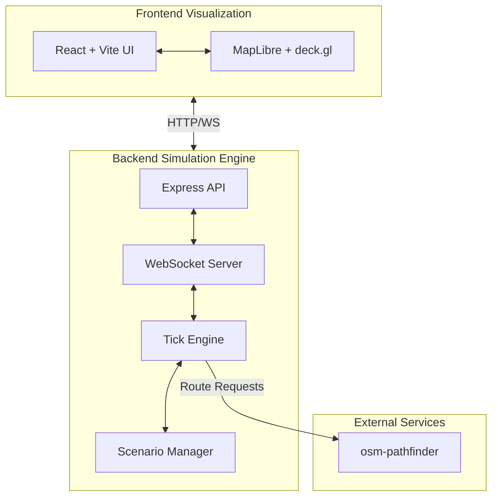

# 📦 Logistics Sandbox

[](https://www.typescriptlang.org/)
[](https://nodejs.org/)
[](https://reactjs.org/)
[](https://vitejs.dev/)
[](https://opensource.org/licenses/MIT)

> A visual digital-twin sandbox for real-time logistics systems.

Logistics Sandbox is a comprehensive, deterministic simulation engine and visualizer designed to model complex supply chain, delivery, and fleet management operations. Focused initially on the Phnom Penh area (Cambodia), it provides a real-time, interactive environment to test routing algorithms, scale infrastructure, and observe intricate logistics behaviors.

## ✨ Key Features

- **🌐 Interactive Digital Twin:** 3D map visualization using MapLibre GL and deck.gl for fleet and facility tracking.
- **⏱️ Deterministic Simulation Engine:** Configurable tick rates, clock speeds, and deterministic replay capabilities.
- **🛣️ Real-World Routing:** Integrates seamlessly with `osm-pathfinder` for realistic road-network navigation.
- **📈 Scalable Architecture:** Built to emulate high-throughput patterns from `ecommerce-hive-nosql`.
- **🔄 Scenario Management:** Define and execute diverse logistical stress tests and edge cases.
- **🔌 Event-Driven:** WebSocket integration for real-time telemetry and state synchronization.

## 🏗️ Architecture Overview

The platform uses a scalable monorepo structure, separating the simulation engine from the visualization layer, while relying on dedicated services for intensive tasks like routing.



## 🚀 Quick Start

### Prerequisites
- [Node.js](https://nodejs.org/) 20 or higher
- [pnpm](https://pnpm.io/) package manager
- `osm-pathfinder` running locally on port 3000

### Setup Instructions

1. **Clone the repository:**
   ```bash
   git clone https://github.com/mengchheanglong/logistics-sandbox.git
   cd logistics-sandbox
   ```

2. **Install dependencies:**
   ```bash
   pnpm install
   ```

3. **Start the Routing Engine:**
   *In a separate terminal, navigate to your `osm-pathfinder` project and start it:*
   ```bash
   cargo run --release
   ```

4. **Start the Backend Engine:**
   ```bash
   pnpm --filter backend dev
   ```

5. **Start the Frontend Client:**
   ```bash
   pnpm --filter frontend dev
   ```

6. **Open the Dashboard:**
   Navigate to `http://localhost:5173` in your browser.

## 📁 Project Structure

```text
logistics-sandbox/
├── apps/
│   ├── backend/            # Express/TypeScript simulation engine
│   └── frontend/           # React/Vite/MapLibre UI
├── packages/               # Shared libraries and types
├── package.json            # Monorepo configuration
└── pnpm-workspace.yaml     # pnpm workspace definition
```

## 🛠️ Technology Stack

| Layer | Technologies |
|-------|-------------|
| **Frontend** | React 18, Vite, TypeScript, MapLibre GL, deck.gl, Tailwind CSS |
| **Backend** | Node.js, Express.js, TypeScript, WebSocket |
| **Routing** | `osm-pathfinder` (Rust, Axum, OpenStreetMap) |
| **Future Storage**| Redis (Caching), Cassandra (Time-series), Neo4j (Graph) |

## 🔗 Integration

Logistics Sandbox relies heavily on realistic data and distributed system patterns.
- **Routing:** It delegates pathfinding and ETA calculations to [osm-pathfinder](https://github.com/mengchheanglong/osm-pathfinder), ensuring accurate real-world navigation.
- **Data Patterns:** It draws architectural inspiration from [ecommerce-hive-nosql](https://github.com/mengchheanglong/ecommerce-hive-nosql) to handle high-throughput logistics events.

## ⚙️ Simulation Engine

The core of the backend is a discrete-event simulation engine. 
- **Tick-based Update:** The world state advances in discrete "ticks".
- **Clock Speed Multiplier:** Run simulations in real-time (1x) or accelerated speeds (e.g., 10x, 100x) for rapid scenario testing.
- **Determinism:** Ensures that running the same scenario with the same seed produces identical results, crucial for debugging algorithms.

## 🎬 Scenarios

Scenarios dictate the initial state of the world—including depots, fleet availability, package volumes, and customer locations. They also define dynamic events, such as traffic spikes or vehicle breakdowns, allowing you to stress-test your logistical logic against various conditions.

## 🗺️ Roadmap

- **Phase V1:** Core engine, monorepo setup, basic map rendering, and 1-to-1 vehicle movement.
- **Phase V2:** Complex routing scenarios, batch dispatching, and historical telemetry playback.
- **Phase V3:** Integration with distributed datastores (Redis, Cassandra) for real-world event ingestion.
- **Phase V4:** AI-driven optimization agents and advanced predictive analytics.

## 🤝 Contributing

Contributions are welcome! Please follow the standard fork-and-pull-request workflow. Ensure that all code passes existing linters and tests before submitting.

## 📄 License

This project is licensed under the [MIT License](LICENSE).

## 🌍 Related Projects

- [osm-pathfinder](https://github.com/mengchheanglong/osm-pathfinder) - High-performance Rust routing engine for OpenStreetMap data.
- [ecommerce-hive-nosql](https://github.com/mengchheanglong/ecommerce-hive-nosql) - Distributed NoSQL microservices architecture.
