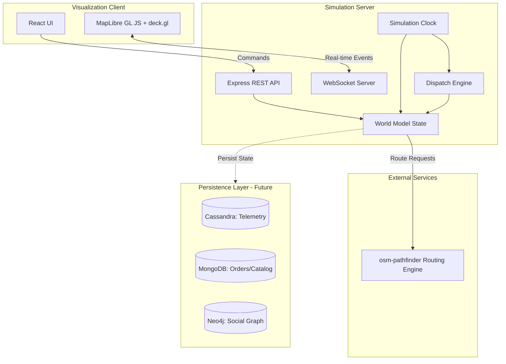
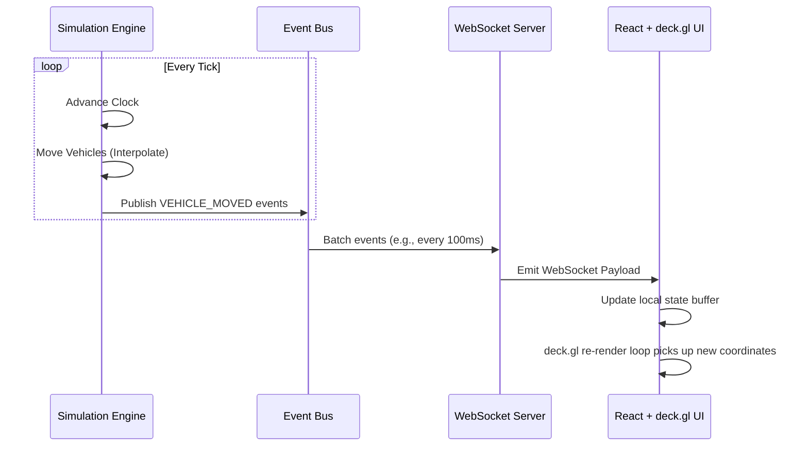

# Logistics Sandbox Architecture

This document outlines the architecture for the **Logistics Sandbox** — a visual digital-twin sandbox for logistics systems, focused primarily on Cambodia (Phnom Penh).

## 1. System Overview

The Logistics Sandbox simulates real-time courier and delivery operations on an actual road network. It features a Node.js simulation backend that handles business logic and vehicle movement, a React/MapLibre-based frontend for rich geographical visualization, and an external Rust-based routing engine (`osm-pathfinder`).



## 2. Module Boundaries

The backend system is separated into distinct operational modules to allow scalability and maintainability:

- **World Model:** The source of truth for all entities (Vehicles, Orders, Depots, etc.) and their current state.
- **Simulation Runtime:** The engine driving the tick-based loop, evaluating entity state changes over time.
- **Routing:** Integration layer talking to `osm-pathfinder` for finding optimal paths between geocoordinates.
- **Dispatch:** Algorithms that match pending Orders with available Vehicles (e.g., nearest neighbor, capacity-constrained matching).
- **Persistence (V1 in-memory):** Storage interfaces for saving/loading simulation snapshots and event logs.
- **Events:** The messaging bus that broadcasts state changes locally to systems and externally to clients.
- **Visualization:** Frontend module that translates the world model state and events into visual deck.gl map layers.
- **Analytics:** Calculates system metrics (delivery times, vehicle utilization, distance traveled).

## 3. Integration Contracts

### osm-pathfinder (Routing Engine)
- **URL:** `http://localhost:3000/api/route`
- **Method:** `POST`
- **Request:**
  ```json
  {
    "start_lat": 11.5564, "start_lon": 104.9282,
    "end_lat": 11.5621, "end_lon": 104.8891,
    "algorithm": "bidirectional_astar",
    "metric": "time",
    "departure_time": "08:30"
  }
  ```
- **Response:**
  ```json
  {
    "path": [[104.9282, 11.5564], ...],
    "distance_m": 4500,
    "duration_s": 600,
    "nodes_visited": 120,
    "query_time_ms": 15,
    "algorithm": "bidirectional_astar",
    "metric": "time",
    "start_snapped": [104.9282, 11.5564],
    "end_snapped": [104.8891, 11.5621]
  }
  ```

### Telemetry Persistence (Derived from ecommerce-hive-nosql)
Future state will persist vehicle movement to Cassandra using this partition schema:
- **Table:** `rider_gps_pings`
- **Partition Key:** `(rider_id, ping_date)`
- **Clustering Key:** `ping_timestamp DESC`
- **Fields:** `lat`, `lon`, `speed_kmh`, `battery_level`, `status`

## 4. Event Model

All state changes generate standard domain events.

**Base Event Structure:**
```typescript
interface DomainEvent {
  eventId: string;
  timestamp: number; // Simulation time
  type: string;
  payload: any;
}
```

**Key Event Taxonomy:**
- `ORDER_CREATED`: `{ orderId, pickup, dropoff, items, total }`
- `VEHICLE_DISPATCHED`: `{ vehicleId, orderId, routePlan }`
- `VEHICLE_MOVED`: `{ vehicleId, lat, lon, heading, speed }`
- `ORDER_DELIVERED`: `{ orderId, vehicleId, timeToDeliver }`
- `SIMULATION_PAUSED` / `SIMULATION_RESUMED` / `SIMULATION_SPEED_CHANGED`

## 5. World Model

The simulation is populated by the following entities:

- **Vehicle:** `{ id, driverId, location: [lon, lat], capacity, utilization, status (IDLE, BUSY), batteryLevel }`
- **Driver:** `{ id, name, shiftStart, shiftEnd, rating }`
- **Order:** `{ id, customerId, pickupLocation, deliveryAddress, items, total, status, assignedCourier, orderTime, SLA }`
- **Warehouse/Depot:** `{ id, location, inventory, connectedVehicles[] }`
- **Customer:** `{ id, location, name, orderHistory[] }`
- **Route:** `{ id, pathPoints[][], distanceM, expectedDurationS }`
- **Package:** `{ id, orderId, weight, dimensions }`
- **Delivery:** `{ id, orderId, vehicleId, routeId, estimatedArrival }`

## 6. Technology Stack

| Component | Technology | Rationale |
| :--- | :--- | :--- |
| **Backend** | Node.js, TypeScript, Express | High I/O throughput for web servers, rapid iteration |
| **Real-time** | WebSockets (ws) | Low latency, bi-directional event stream for vehicle movements |
| **Frontend** | React 18, Vite | Performant UI rendering, modern build tooling |
| **Map Rendering**| MapLibre GL JS, deck.gl | High-performance WebGL rendering of millions of data points |
| **Routing** | osm-pathfinder (Rust) | Blazing fast shortest-path calculations on physical graphs |
| **Testing** | Vitest | Fast, native TS support, compatible with Vite frontend |
| **Persistence** | In-memory (V1) | Speed of development; decoupled via interfaces for future DBs |

## 7. V1 Scope

The initial milestone focuses on laying the interactive groundwork:
- ✅ Basic simulation clock with speed controls.
- ✅ In-memory world model with a finite set of Depots, Orders, and Vehicles.
- ✅ Integration with `osm-pathfinder` for realistic path generation in Phnom Penh.
- ✅ Vehicle movement logic along route geometry.
- ✅ WebSocket event streaming to the UI.
- ✅ deck.gl visualization of vehicles moving on the map.

## 8. Phased Roadmap

- **Phase 1 (V1 - Current):** Core simulation loop, routing integration, real-time visualization. In-memory data.
- **Phase 2 (V2):** Advanced Dispatching (capacity constraints, batching). Shift scheduling. Time-dependent traffic modeling visualization.
- **Phase 3 (V3 - Persistence):** Integrate the `ecommerce-hive-nosql` data layer. Cassandra for rider telemetry, MongoDB for orders.
- **Phase 4 (V4 - Analytics):** Hive/HDFS OLAP integration. Analytics dashboard (heatmap of late deliveries, courier utilization metrics). Social/Referral Graph integration.

## 9. What Is Reused

- **`osm-pathfinder`:** The entire physical road graph routing logic, time-dependent traffic models, and spatial index (R-tree) for coordinate snapping.
- **Data Models:** The Order and Rider Ping domain logic and structure from `ecommerce-hive-nosql`.

## 10. What Is New

- **Simulation Engine:** The Node.js tick-based environment simulating real-world time and physical movement.
- **deck.gl Visualization:** WebGL rendering of the sandbox state, replacing standard tabular dashboards.
- **Event Bus:** The WebSocket-based pub/sub system linking the ticking backend with the visual frontend.

## 11. What Is Intentionally Deferred

- **Database Persistence:** Deferred to V3 to prioritize core simulation mechanics and visual validation. Interfaces will abstract data access in V1.
- **Real-world GPS ingestion:** This sandbox uses simulated telemetry rather than ingesting real driver devices.
- **Complex UI Forms:** The frontend will focus on the map and simulation controls rather than CRUD forms for managing the catalog.

## 12. Graph Distinction

There are two fundamentally different "graphs" involved in the broader architecture:
1. **Physical Road Graph:** Managed completely by `osm-pathfinder` (Rust). It represents OSM nodes and edges (roads). Used exclusively for finding physical paths and travel times.
2. **Business Relationship Graph (Deferred to Neo4j):** Represents Customers and REFERRED relationships. Used for marketing, analytics, and fraud detection. Does not impact vehicle movement.

## 13. Simulation Clock

The simulation operates on a custom "Tick" loop rather than pure wall-clock time.
- **Base Tick Rate:** The loop runs at a fixed interval (e.g., 100ms wall-clock time).
- **Time Multiplier:** The ratio of simulation time to wall-clock time.
  - `Pause`: Delta = 0.
  - `1x`: 1 second real = 1 second simulation.
  - `10x`: 1 second real = 10 seconds simulation.
  - `60x`: 1 second real = 1 minute simulation.
  - `600x`: 1 second real = 10 minutes simulation.
- The state engine advances entities by `Delta * Multiplier` each tick.

## 14. Vehicle Movement

Vehicles do not jump from node to node; they move smoothly along the path.
1. The routing engine returns a path: `[Point A, Point B, Point C]`.
2. The simulation calculates the distance of each segment (e.g., A->B).
3. On every tick, the vehicle travels a distance of `Speed * (Delta * Multiplier)`.
4. The vehicle's exact `[lon, lat]` is interpolated linearly along the current segment.
5. Once a segment is consumed, the vehicle begins traversing the next segment.

## 15. Data Flow Diagrams

### Event Flow: Simulation to Visualization


